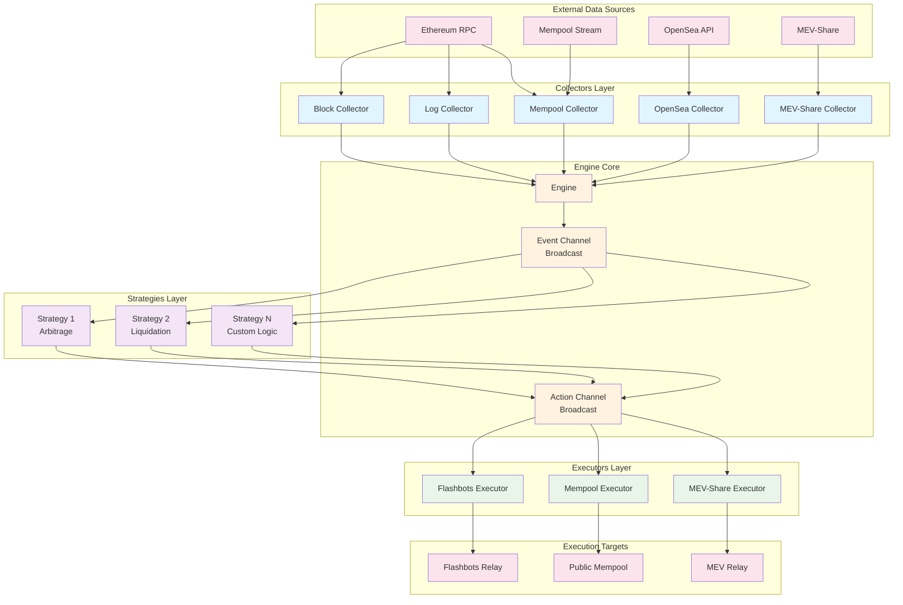
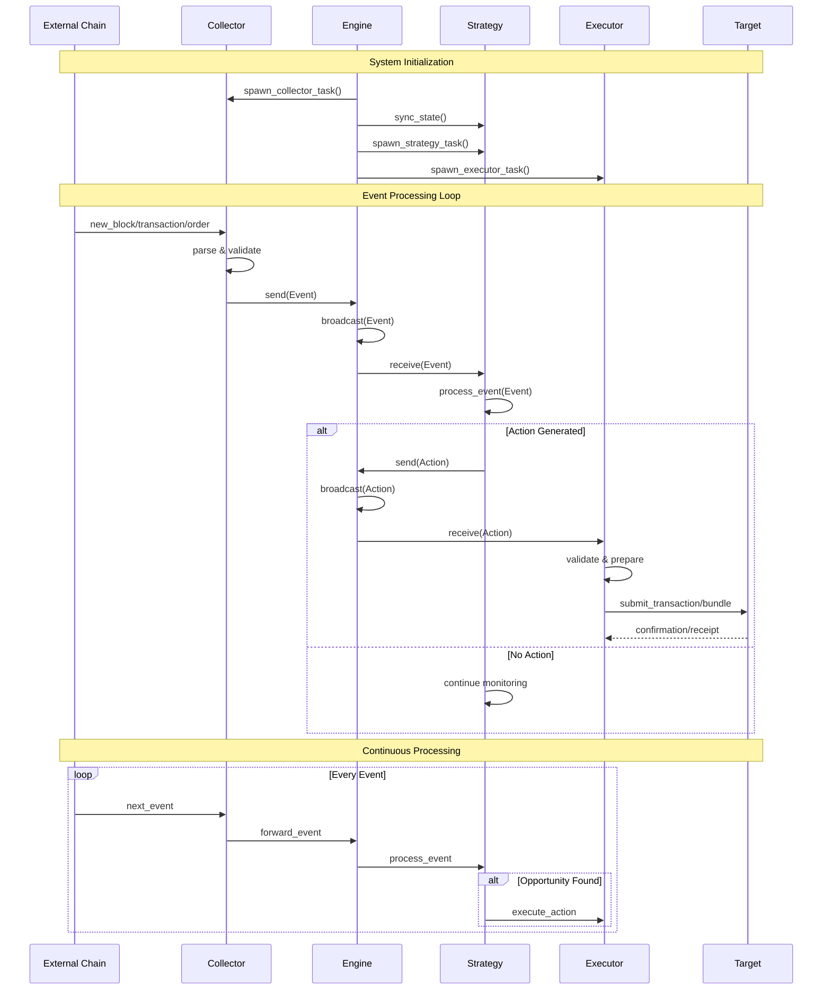
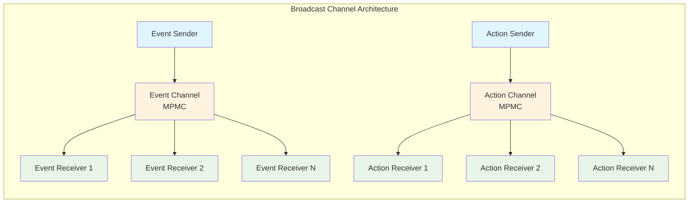

# Artemis Core

A high-performance MEV (Maximal Extractable Value) bot framework written in Rust, designed for building arbitrage and MEV strategies on Ethereum. Artemis Core implements a modular, event-driven architecture optimized for speed and reliability.

## Architecture Overview

Artemis Core follows a **three-stage pipeline architecture**: **Collectors** → **Strategies** → **Executors**

The framework is built around an event-driven model where data flows through specialized components:

- **Collectors**: Data sources that emit blockchain events (blocks, mempool, logs, orders)
- **Strategies**: Business logic that processes events and generates actions
- **Executors**: Submit transactions/bundles to various execution layers
- **Engine**: Orchestrates all components using Tokio broadcast channels for event distribution

## System Architecture



## Event Flow Sequence



## Core Components

### Engine (`engine.rs`)

The `Engine` is the central orchestrator that manages data flow between all components:

```rust
pub struct Engine<E, A> {
    collectors: Vec<Box<dyn Collector<E>>>,
    strategies: Vec<Box<dyn Strategy<E, A>>>,
    executors: Vec<Box<dyn Executor<A>>>,
    event_channel_capacity: usize,
    action_channel_capacity: usize,
}
```

**Key Features:**
- **Async Event Broadcasting**: Uses Tokio broadcast channels for high-performance event distribution
- **Concurrent Processing**: Each component runs in its own async task
- **Backpressure Handling**: Configurable channel capacities prevent memory bloat
- **Error Resilience**: Individual component failures don't crash the entire system

### Collectors

Collectors transform external data sources into internal events:

#### Available Collectors:
- **`BlockCollector`**: Monitors new blocks from Ethereum RPC
- **`LogCollector`**: Filters and processes event logs
- **`MempoolCollector`**: Streams pending transactions
- **`OpenseaOrderCollector`**: Fetches marketplace orders
- **`MevshareCollector`**: Processes MEV-Share events

```rust
#[async_trait]
pub trait Collector<E>: Send + Sync {
    async fn get_event_stream<'a>(&'a self) -> Result<CollectorStream<'a, E>>;
}
```

### Strategies

Strategies contain the core MEV logic, processing events and generating actions:

```rust
#[async_trait]
pub trait Strategy<E, A>: Send + Sync {
    async fn sync_state(&mut self) -> Result<()>;
    async fn process_event(&mut self, event: E) -> Vec<A>;
}
```

**Strategy Lifecycle:**
1. **State Synchronization**: Initial onchain data fetching
2. **Event Processing**: Continuous monitoring and analysis
3. **Action Generation**: Create executable actions when opportunities arise

### Executors

Executors handle action execution across different domains:

#### Available Executors:
- **`FlashbotsExecutor`**: Submits bundles to Flashbots relay
- **`MempoolExecutor`**: Publishes transactions to public mempool
- **`MevShareExecutor`**: Uses MEV-Share for private execution

```rust
#[async_trait]
pub trait Executor<A>: Send + Sync {
    async fn execute(&self, action: A) -> Result<()>;
}
```

## Data Flow Architecture

### Event Broadcasting Model



### Type System

The framework uses generic types for flexibility:

```rust
// Core event types
pub enum Events {
    NewBlock(NewBlock),
    Transaction(Box<Transaction>),
    OpenseaOrder(Box<OpenseaOrder>),
}

// Core action types  
pub enum Actions {
    FlashbotsBundle(FlashbotsBundle),
    SubmitTxToMempool(Box<SubmitTxToMempool>),
}
```

## Performance Characteristics

### Concurrency Model
- **Async/Await**: Non-blocking I/O for all network operations
- **Tokio Runtime**: High-performance async runtime
- **Broadcast Channels**: Lock-free message passing
- **Independent Tasks**: Each component runs concurrently

### Memory Management
- **Zero-Copy Broadcasting**: Events shared across strategies without cloning
- **Bounded Channels**: Configurable capacity prevents unbounded growth
- **Efficient Serialization**: Minimal overhead for event processing

### Error Handling
- **Component Isolation**: Individual failures don't affect others
- **Graceful Degradation**: System continues operating with reduced functionality
- **Comprehensive Logging**: Detailed error reporting for debugging

## Usage Example

```rust
use artemis_core::engine::Engine;
use artemis_core::types::{Events, Actions};

#[tokio::main]
async fn main() -> Result<(), Box<dyn std::error::Error>> {
    let mut engine = Engine::<Events, Actions>::new()
        .with_event_channel_capacity(1024)
        .with_action_channel_capacity(512);

    // Add collectors
    engine.add_collector(Box::new(block_collector));
    engine.add_collector(Box::new(mempool_collector));

    // Add strategies
    engine.add_strategy(Box::new(arbitrage_strategy));
    engine.add_strategy(Box::new(liquidation_strategy));

    // Add executors
    engine.add_executor(Box::new(flashbots_executor));
    engine.add_executor(Box::new(mempool_executor));

    // Start the engine
    let mut set = engine.run().await?;
    
    // Wait for all tasks to complete
    while let Some(res) = set.join_next().await {
        if let Err(e) = res {
            eprintln!("Task failed: {}", e);
        }
    }

    Ok(())
}
```

## Extension Points

### Custom Collectors
Implement the `Collector` trait to add new data sources:

```rust
struct MyCustomCollector;

#[async_trait]
impl Collector<MyEvent> for MyCustomCollector {
    async fn get_event_stream<'a>(&'a self) -> Result<CollectorStream<'a, MyEvent>> {
        // Implementation
    }
}
```

### Custom Strategies
Implement the `Strategy` trait for custom MEV logic:

```rust
struct MyArbitrageStrategy;

#[async_trait]
impl Strategy<Events, Actions> for MyArbitrageStrategy {
    async fn sync_state(&mut self) -> Result<()> {
        // Initial state sync
    }

    async fn process_event(&mut self, event: Events) -> Vec<Actions> {
        // Process events and generate actions
    }
}
```

### Custom Executors
Implement the `Executor` trait for new execution targets:

```rust
struct MyCustomExecutor;

#[async_trait]
impl Executor<Actions> for MyCustomExecutor {
    async fn execute(&self, action: Actions) -> Result<()> {
        // Execute the action
    }
}
```

## Dependencies

- **Tokio**: Async runtime and utilities
- **Ethers**: Ethereum client library
- **Anyhow**: Error handling
- **Async-trait**: Async trait support
- **Tokio-stream**: Stream utilities
- **Tracing**: Structured logging

## Testing

The framework includes comprehensive testing:

```bash
# Run all tests
cargo test

# Run with output
cargo test -- --nocapture

# Run specific test module
cargo test engine::tests
```

## Contributing

When extending Artemis Core:

1. Follow the existing trait patterns
2. Implement proper error handling
3. Add comprehensive tests
4. Use structured logging with `tracing`
5. Document public APIs thoroughly
6. Maintain async compatibility throughout

## License

This project is part of the Artemis MEV framework.